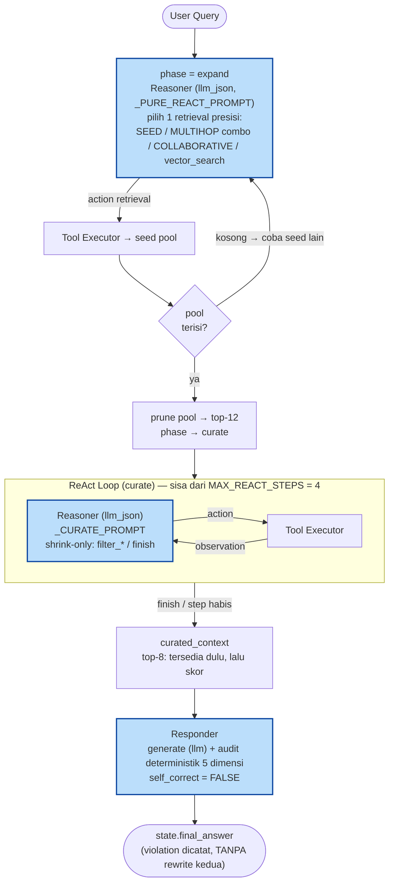
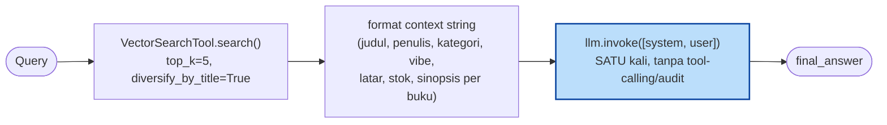
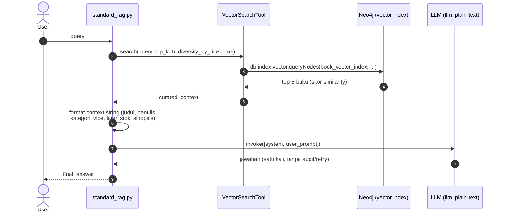
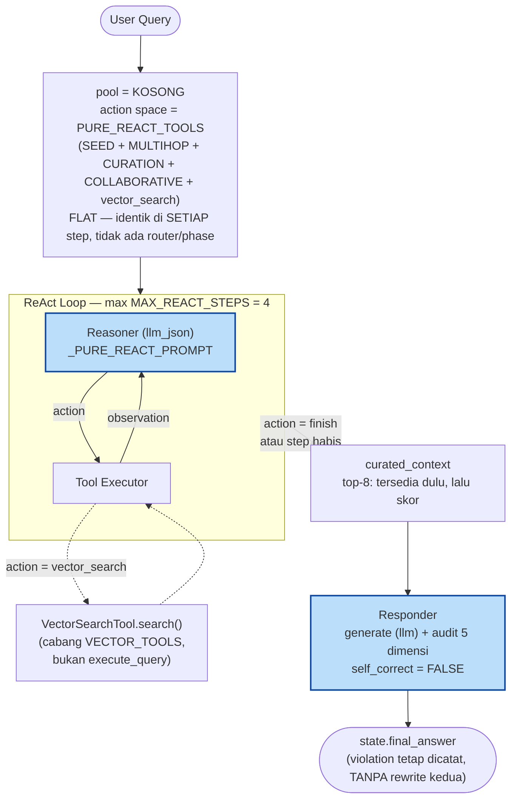
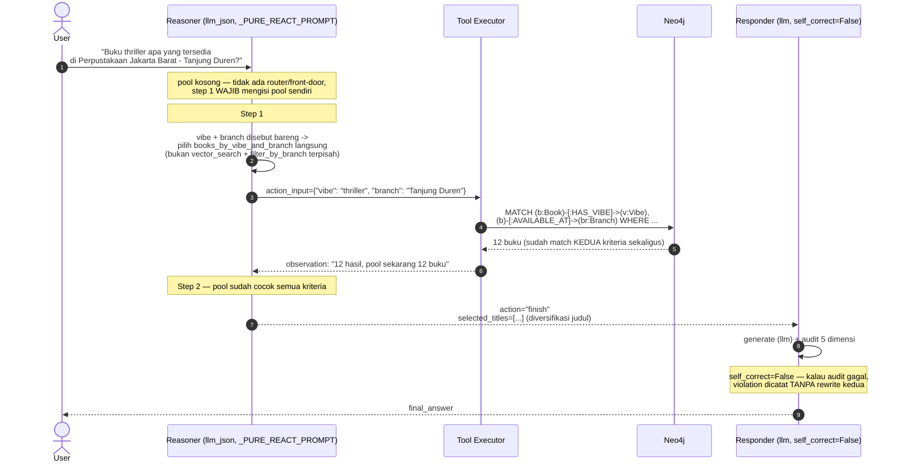
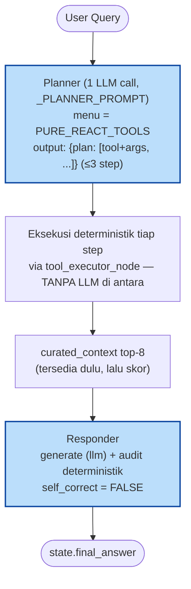
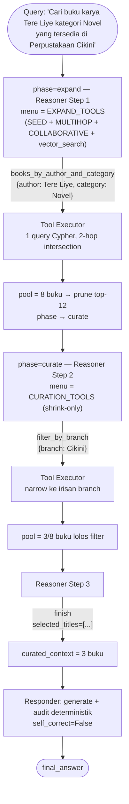
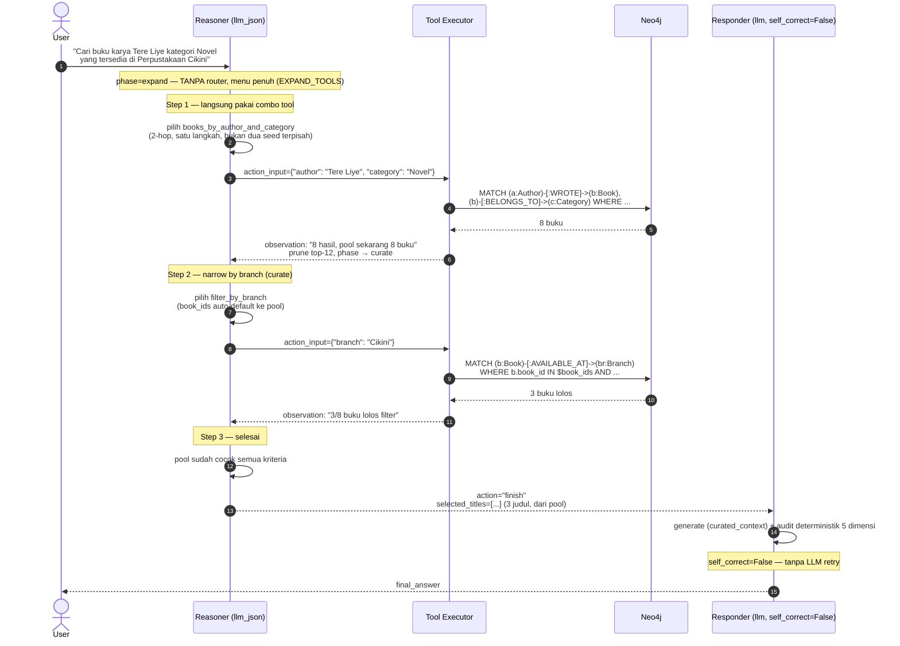

# Agent Workflow

## Gambaran Umum

Arsitektur agent adalah **Search-Space-Gated ReAct** (kode di `workflow.py`,
historisnya disebut "Vector-Gated"). Reasoner bebas memilih **satu retrieval
paling presisi** untuk membentuk pool awal (fase `expand`) — seed atribut
tunggal, kombinasi multi-atribut, collaborative "mirip X", atau `vector_search`
— lalu pool di-**prune** ke top-K dan action space menyempit ke **kurasi
shrink-only** (fase `curate`). Yang di-gate adalah **search space** (ukuran
pool), bukan menu tool.

> **Perubahan dari v1.** Versi awal ("Vector-Gated ReAct v1") menyempitkan
> *action space* lewat router regex + phase: query bertema/vibe diroute ke
> vector front-door dan hanya boleh `filter_*` — combo multi-hop & collaborative
> diblok. Itu meruntuhkan retrieval multi-hop (P@3 3-hop ~0.10). v2 membuang
> router/front-door, menyerahkan pemilihan retrieval ke reasoner, dan memindah
> gating ke pertumbuhan pool → multi-hop pulih (3-hop ~0.52). Data & rasional:
> [hasil.md](hasil.md) § Ringkasan Terbaru, [catatan_riset.md § 4.1](catatan_riset.md).



Loop `reasoner ⇄ tool_executor` berjalan maksimal **`MAX_REACT_STEPS = 4`** kali
([agent/core/workflow.py](../agent/core/workflow.py)). Fase `expand` memakai
prompt full-autonomy (`_PURE_REACT_PROMPT`) supaya reasoner tahu cara memilih
entry-point; setelah satu retrieval berhasil (pool ≠ ∅), `workflow.py` mem-prune
pool ke top-12 dan mengganti prompt ke `_CURATE_PROMPT` (menu tinggal `filter_*`
+ `finish`). Begitu reasoner memilih `finish` (atau step habis), `responder_node`
dipanggil sekali — generate + audit deterministik, **tanpa** self-correct retry
(default `self_correct=False`, lihat [Node 3](#node-3-responder-synthesis--self-audit)).
Tidak ada lagi router/front-door di luar loop — [`router.py`](../agent/core/router.py)
masih ada tapi **tidak dipakai** `workflow.py` v2.

Selain ReAct ini, ada tiga pipeline lain untuk evaluasi komparatif:
**`run_standard_rag()`** ([Standard RAG Baseline](#standard-rag-baseline-pembanding)
— single-hop vector, tanpa loop), **`run_workflow_pure_react()`**
([Pure ReAct Ablation](#pure-full-autonomy-react-ablation) — action space flat,
tanpa gating search-space), dan **`run_workflow_planned()`**
([Planned Single-Shot](#planned-single-shot-ablation) — rencana retrieval sekali
di depan, tanpa loop).

---

## Node 1: Reasoner (The Brain)

**File**: [agent/nodes/reasoner.py](../agent/nodes/reasoner.py)

### Tanggung Jawab

Pada setiap putaran loop, baca scratchpad (riwayat Thought/Action/Observation)
lalu putuskan satu dari dua hal:
- Pilih **tool** yang dipanggil berikutnya + argumennya, atau
- Putuskan **FINISH** karena pool kandidat sudah cukup → lanjut ke Responder.

### LLM yang dipakai

Reasoner memakai singleton `llm_json` dari
[agent/services/llm_services.py](../agent/services/llm_services.py) —
**bukan** `llm` biasa yang dipakai Responder. Bedanya:

| Aspek | `llm` (plain) | `llm_json` (reasoner) |
|-------|---------------|------------------------|
| Ollama `format` | tidak diset | `"json"` (grammar-constrained) |
| `num_predict` | 700 | 500 |
| Tujuan | prosa 2–4 paragraf | objek aksi JSON kecil |

`format="json"` mengunci Ollama untuk hanya men-generate token yang valid
secara grammar JSON — ini menghilangkan kebutuhan reasoner melakukan retry
penuh (LLM call kedua) saat output gagal di-parse, yang sebelumnya jadi
sumber latency tersembunyi paling mahal di loop ini.

### Prinsip Kerja (System Prompt)

System prompt menanamkan 6 prinsip ke reasoner ([agent/nodes/reasoner.py](../agent/nodes/reasoner.py)):

1. **Nama asli, bukan ID** — gunakan judul/penulis/cabang dalam thought & argumen tool, bukan `book_id`.
2. **FINISH eksplisit** — saat target tercapai, pilih `action: "finish"` dan tentukan `selected_titles` (harus persis dari judul yang sudah ada di pool, bukan dikarang).
3. **Keberagaman judul** — saat FINISH, pilih judul yang beragam; jangan merekomendasikan dua edisi/jilid dari buku yang sama.
4. **Jangan berhalusinasi** — argumen tool harus diturunkan dari query. Jika query tidak menyebut atribut tambahan, langsung FINISH dengan pool yang ada.
5. **Jangan mengulang tool call yang sama** jika argumen+hasil sebelumnya identik dan 0 hasil — FINISH dengan pool seadanya.
6. **Satu tool per langkah, persis seperti yang terdaftar** — tidak boleh menggabungkan dua atribut ke nama tool yang tidak ada di katalog (mis. `books_by_author_and_branch` tidak ada). Kriteria lokasi/cabang selalu lewat `filter_by_branch` di langkah terpisah.

> Catatan (v2): di fase `expand` reasoner **boleh** memilih retrieval apa pun —
> `vector_search`, combo multi-atribut, atau collaborative — itu yang membentuk
> pool awal. Setelah pool terisi & di-prune, fase `curate` mempersempit menu ke
> `filter_*`/`finish` saja (shrink-only, prompt `_CURATE_PROMPT`); di fase ini
> tidak ada retrieval lagi, dan satu-satunya jalan keluar dari "stuck" adalah
> FINISH dengan pool seadanya (lihat [Penanganan Kasus Tepi](#penanganan-kasus-tepi)).

#### Kenapa instruksi dalam Bahasa Inggris, padahal datanya Bahasa Indonesia?

Judul buku, nama penulis, vibe, setting, dan query user semuanya Bahasa
Indonesia (katalog Perpustakaan Umum Jakarta) — itu **tetap** Bahasa
Indonesia, prompt secara eksplisit melarang menerjemahkan nilai entitas.
Tapi teks **instruksi/aturan** (prinsip kerja, format JSON, nama
tool/header grup) sengaja ditulis Bahasa Inggris:

- **Llama 3.1** model card resminya cuma mendaftar 8 bahasa "officially
  supported" (English, German, French, Italian, Portuguese, Hindi,
  Spanish, Thai) — Bahasa Indonesia **tidak** termasuk. Llama 3.1 tetap
  bisa generate Bahasa Indonesia yang fasih (data pretraining luas), tapi
  *instruction-following* tervalidasi-nya English-first.
- **Qwen 2.5** technical report mengklaim dukungan jauh lebih luas
  (~29 bahasa, termasuk Indonesia secara eksplisit) — lebih kuat secara
  native di sini dibanding Llama.

Karena kedua model dibandingkan langsung di proyek ini, titik temu paling
aman adalah pola standar agentic-LLM multibahasa: **scaffolding (aturan,
format spec, skema tool) pakai bahasa yang instruction-tuning-nya paling
dalam di KEDUA model — English — sementara konten (judul, nama entitas,
query user, jawaban akhir) tetap Bahasa Indonesia** karena itu data asli
yang tidak boleh diterjemahkan. Field `"thought"` sengaja dibiarkan bebas
(Indonesia atau Inggris) — di praktik, model biasanya menjawab dalam
bahasa yang sama dengan query, jadi log `reasoning_log` tetap kebanyakan
terbaca dalam Bahasa Indonesia meski instruksinya Inggris. Lihat
[catatan_riset.md](catatan_riset.md) untuk diskusi lengkapnya.

### Format Output (wajib)

```json
{
  "thought": "<analisis singkat>",
  "action": "<nama tool ATAU 'finish'>",
  "action_input": { "...argumen sesuai schema tool..." },
  "selected_titles": ["Judul Buku A", "Judul Buku B"]
}
```

`selected_titles` hanya wajib diisi saat `action == "finish"`, dan harus
diambil persis dari judul yang sudah muncul di pool (ditampilkan ke reasoner
sebagai "Status pool kandidat") — bukan judul yang dikarang.

### Verbatim System Prompt

Teks persis yang dikirim sebagai `SystemMessage` (template — `{tool_specs}`
di-render oleh `build_specs_prompt()`, lihat [Tool Registry](#tool-registry)
untuk desain grouping-nya). Disalin langsung dari
[agent/nodes/reasoner.py](../agent/nodes/reasoner.py) supaya selalu bisa
diaudit dari docs tanpa buka source — **kalau prompt-nya diubah di kode,
update juga di sini.**

Prompt mana yang dipakai per arm/fase:

- **VG-v2 fase `expand`** & **Pure ReAct**: `_PURE_REACT_PROMPT` (ditempel di bawah).
- **VG-v2 fase `curate`**: `_CURATE_PROMPT` — menu shrink-only, framing "pool
  sudah terbentuk, kamu HANYA menyaring/`finish`, JANGAN retrieve" (menegaskan
  aksi valid = `filter_*` + `finish`). Ditambahkan supaya model kecil tidak
  buang step mencoba retrieval yang sudah diblok di fase ini — lihat
  [reasoner.py](../agent/nodes/reasoner.py).
- **Act-only**: `_ACT_ONLY_PROMPT` (identik `_PURE_REACT_PROMPT` tanpa field `thought`).
- `_BASE_PROMPT` di bawah = **legacy v1** (curate framing lama saat MULTIHOP masih
  di-expose di curate). **Tidak dipakai** `workflow.py` v2; dipertahankan sebagai referensi.

<details>
<summary><strong>Vector-Gated v1 (legacy) — <code>_BASE_PROMPT</code></strong></summary>

```text
You are a navigation/curation agent for a library book
recommendation system. Theme/mood matching (semantic matching) has ALREADY
been resolved before you were called — the candidate pool below is already
thematically relevant (via vector search) or matches the attribute the user
named (via one structured lookup). Your job is ONLY relational
navigation/curation over that pool: narrowing it, reporting on it, or — if
the user mentioned it — extending precision via another attribute combo.
Your goal: make sure the final pool truly matches every criterion in the
user's request, then stop.

Book titles, author names, vibes, settings, and user requests are in Bahasa
Indonesia (Jakarta Public Library catalog) — read and extract them as-is,
do NOT translate entity values.

Neo4j Knowledge Graph ontology:

  (:Author)-[:WROTE]->(:Book)-[:PUBLISHED_BY]->(:Publisher)
                            ↓
                   [:BELONGS_TO]->(:Category)
                   [:AVAILABLE_AT]->(:Branch)       ← supernode (1,303 rels)
                   [:CLASSIFIED_AS]->(:DDCClass)     (Dewey code, e.g. "813")
                   [:WRITTEN_IN]->(:Language)
                   [:COLLECTION_TYPE]->(:CollectionType)
                   [:HAS_VIBE]->(:Vibe)
                   [:HAS_SETTING]->(:Setting)
                   [:FEATURES_CHARACTER]->(:Character)

WORKING PRINCIPLES:
1. Use real entity names (Title, Author, Branch) in your reasoning and
   searches, NEVER internal IDs.
2. Once the target is met, choose action "finish" and list the best book
   titles.
3. TITLE DIVERSITY: when selecting titles, pick DIVERSE books. Do not
   recommend the same book repeatedly just because it's a different
   edition/volume. Look for other relevant title variety in the candidate
   pool.
4. DO NOT HALLUCINATE. Tool arguments must be derived from the user's
   query. If the query doesn't mention an additional attribute, FINISH
   immediately with the current pool.
5. DO NOT REPEAT THE SAME TOOL CALL. If tool X with argument Y just
   returned 0 results / an empty pool, do NOT call it again with the same
   argument — FINISH with what you have.
6. ONE TOOL PER STEP, EXACTLY AS LISTED. Do NOT combine two attributes
   into a tool name that does NOT exist in the list (e.g.
   "books_by_author_and_branch" does NOT exist — that's not a valid
   tool). Location/branch criteria ALWAYS go through filter_by_branch in a
   SEPARATE step (this may be the first step if the pool already has
   content, or a later step after a seed lookup has formed the pool).

AVAILABLE TOOLS (grouped under [HEADERS] for clarity only — headers are not
literal syntax, you may still pick any tool from any group):
{tool_specs}

OUTPUT FORMAT — MUST BE A SINGLE JSON OBJECT ONLY. NO opening/closing text,
NO explanation, NO markdown fence. OUTPUT ONLY THIS JSON OBJECT:

{
  "thought": "Pool already has enough title variety. I'll pick the 5 most diverse and relevant titles.",
  "action": "finish",
  "selected_titles": ["Book Title A", "Book Title B", "Book Title C"]
}

EXAMPLES:
- Pool already has thematic candidates, user also mentioned branch "Cikini" ->
  {"thought": "...", "action": "filter_by_branch", "action_input": {"branch": "Cikini"} }
- Pool already matches all criteria -> TAKE titles from "Status pool kandidat" below:
  {"thought": "Pool is sufficient, finalizing.", "action": "finish",
    "selected_titles": ["Hujan", "Senja di Jakarta"]}
  NOTE: selected_titles must be taken EXACTLY from the pool (shown in
  "Status pool kandidat" in the message below), DO NOT invent new titles.
```

</details>

<details>
<summary><strong>Pure Full-Autonomy ReAct — <code>_PURE_REACT_PROMPT</code></strong> (lihat <a href="#pure-full-autonomy-react-ablation">bagian ablation</a>)</summary>

```text
You are a fully autonomous library book search/recommendation
agent. There is NO front-door or router outside of you — you decide yourself
whether a query needs semantic search (vector_search) or a specific attribute
lookup in the Knowledge Graph, and you are free to combine both in any order.
The candidate pool starts EMPTY — your first step MUST populate it.

Book titles, author names, vibes, settings, and user queries are in Bahasa
Indonesia (Jakarta Public Library catalog) — read and extract them as-is,
do NOT translate entity values.

Neo4j Knowledge Graph ontology:

  (:Author)-[:WROTE]->(:Book)-[:PUBLISHED_BY]->(:Publisher)
                            ↓
                   [:BELONGS_TO]->(:Category)
                   [:AVAILABLE_AT]->(:Branch)       ← supernode (1,303 rels)
                   [:CLASSIFIED_AS]->(:DDCClass)     (Dewey code, e.g. "813")
                   [:WRITTEN_IN]->(:Language)
                   [:COLLECTION_TYPE]->(:CollectionType)
                   [:HAS_VIBE]->(:Vibe)
                   [:HAS_SETTING]->(:Setting)
                   [:FEATURES_CHARACTER]->(:Character)

WORKING PRINCIPLES:
1. Use real entity names (Title, Author, Branch) in your reasoning and tool
   arguments, NEVER internal IDs.
2. PICK THE RIGHT ENTRY POINT. Thematic/abstract queries (vibe, mood, "similar
   to book X") -> use `vector_search`. Queries naming a concrete attribute
   (author, category, DDC, language, branch, title) -> use the matching
   `books_by_*` tool. You may use both in sequence if the query combines
   thematic and concrete criteria.
3. Once the target is met, choose action "finish" and list the best book titles.
4. TITLE DIVERSITY: when selecting titles, pick DIVERSE books. Do not
   recommend the same book repeatedly just because it's a different
   edition/volume. Look for other relevant title variety in the candidate pool.
5. DO NOT HALLUCINATE. Tool arguments must be derived from the user's query.
   If the query doesn't mention an additional attribute, FINISH immediately
   with the current pool.
6. DO NOT REPEAT THE SAME TOOL CALL. If tool X with argument Y just returned
   0 results / an empty pool, do NOT call it again with the same argument —
   try a different entry point, or FINISH with what you have.
7. ONE TOOL PER STEP, EXACTLY AS LISTED. Do NOT invent tool names that are NOT
   in the list below — in particular, do NOT invent `filter_by_vibe`,
   `filter_by_setting`, `filter_by_category`, or `filter_by_author`. The only
   valid filters are `filter_by_branch`, `filter_by_collection_type`,
   `filter_by_language`. For vibe/setting/category, use `books_by_vibe`,
   `books_by_setting`, `books_by_category`, or their combinations
   (`books_by_vibe_and_setting`, etc.) — NOT a `filter_by_*` tool.

AVAILABLE TOOLS (grouped under [HEADERS] for clarity only — headers are not
literal syntax, you may still pick any tool from any group):
{tool_specs}

OUTPUT FORMAT — MUST BE A SINGLE JSON OBJECT ONLY. NO opening/closing text, NO
explanation, NO markdown fence. OUTPUT ONLY THIS JSON OBJECT:

{
  "thought": "<your reasoning, Bahasa Indonesia or English, either is fine>",
  "action": "vector_search",
  "action_input": {"query": "novel romantis berlatar pedesaan"}
}

EXAMPLES:
- Thematic/abstract query -> {"thought": "...", "action": "vector_search", "action_input": {"query": "<query text>"} }
- Query naming a specific author -> {"thought": "...", "action": "books_by_author", "action_input": {"author": "Tere Liye"} }
- Pool already has candidates, user also mentioned branch "Cikini" ->
  {"thought": "...", "action": "filter_by_branch", "action_input": {"branch": "Cikini"} }
- Pool already matches all criteria -> TAKE titles from "Status pool kandidat" below:
  {"thought": "Pool is sufficient, finalizing.", "action": "finish",
    "selected_titles": ["Hujan", "Senja di Jakarta"]}
  NOTE: selected_titles must be taken EXACTLY from the pool (shown in "Status
  pool kandidat" in the message below), DO NOT invent new titles.
```

</details>

### Parsing JSON (defensif, jarang dipakai sejak `format="json"`)

`_extract_json()` punya 3 lapis fallback (parse langsung → strip markdown
fence → brace-balanced scan). Jika ketiganya gagal, reasoner retry **satu
kali** dengan reminder eksplisit. Jika retry kedua juga gagal, loop dipaksa
FINISH dengan pool apa adanya.

### Penanganan Kasus Tepi

| Kondisi | Penanganan |
|---|---|
| Action tidak ada di subset tool yang diizinkan langkah ini (`tool_names`) | Observation informatif + daftar tool valid; loop lanjut, tidak dianggap FINISH |
| Action invalid yang sama diulang dua kali berturut-turut | Paksa FINISH dengan pool saat ini (model kecil 8B/7B tidak akan koreksi sendiri) |
| Action+args sama persis dengan step sebelumnya **dan** observation sebelumnya menunjukkan 0 hasil | Paksa FINISH dengan pool saat ini — **tidak ada** fallback ke `vector_search` (tool itu tidak ada di action space reasoner) |
| `filter_by_branch`/`_collection_type`/`_language` akan menghapus pool non-kosong jadi kosong (argumen ungrounded/hallucinated) | `tool_executor.py` membatalkan narrowing-nya, pool dipertahankan, observation tetap melaporkan 0 hasil agar reasoner tahu filter itu gagal (lihat [tool_executor.py](../agent/nodes/tool_executor.py)) |
| Parse-fail 2× berturut-turut | Paksa FINISH |
| `MAX_REACT_STEPS` (4) tercapai tanpa FINISH | `workflow.py` mengambil top-8 dari pool (urut: tersedia dulu, lalu skor) sebagai `curated_context` |

### Kurasi `curated_context` (`_select_curated`)

Saat FINISH: ambil judul yang valid dari `selected_titles`, urutkan
(tersedia di branch dulu, lalu skor tertinggi), potong ke top-8. Jika
reasoner tidak menyebut ID valid sama sekali, fallback ke top-8 pool
berdasarkan skor.

---

## Node 2: Tool Executor (The Hands)

**File**: [agent/nodes/tool_executor.py](../agent/nodes/tool_executor.py)

### Tanggung Jawab

Generic dispatcher tipis di atas katalog `CYPHER_TOOLS` — tidak ada
keputusan strategis di sini (itu tugas Reasoner), dan tidak ada wrapper
Python per-tool:

1. Ambil `state.next_action` → `(tool_name, args)`.
2. Isi param yang dideklarasikan tool dari `args` (+ auto-default untuk
   `book_ids`/`top_k`/`raw_k`/`min_score` yang umum).
3. Jalankan `cypher` template tool itu via `execute_query()`.
4. Merge/narrow hasil ke pool internal (dict by `book_id`) — semantik
   tergantung jenis tool, lihat di bawah.
5. Re-parse pool → `list[BookNode]` untuk `state.enriched_data`.
6. Tulis observation kembali ke `ReActStep` terakhir di scratchpad.

### Lazy Tool Clients

Hanya `VectorSearchTool` (model embedding E5) yang diinisialisasi sebagai
singleton module-level di `workflow.py`, dibuat saat pertama dipanggil —
bukan saat import. Ini menghindari biaya load model SentenceTransformer di
setiap query kalau prosesnya dipakai berulang (mis. saat batch evaluasi 30
query). Semua tool lain adalah **Cypher template stateless** yang dijalankan
langsung lewat `execute_query()` — tidak ada class tool/registry Python di
sisi mereka.

### Merge & Narrow Semantics

Tergantung kategori tool ([agent/tools/tools_catalog.py](../agent/tools/tools_catalog.py)):

- **Seed/multihop/collaborative lookups** (semua yang bukan FILTER_TOOLS
  atau NON_BOOK_TOOLS): hasil baru di-merge ke pool berdasarkan `book_id`.
  Jika buku sudah ada → relasi (`authors`, `vibes`, `settings`, `branches`,
  `categories`, `characters`) di-union, bukan ditimpa. Skor diambil yang
  **tertinggi** antara skor lama vs baru, ditambah boost per tool: kombinasi
  multihop (`books_by_vibe_and_setting`, dst.) → +0.05, tool single-hop
  lainnya → +0.02.
- **`FILTER_TOOLS`** (`filter_by_branch`, `filter_by_collection_type`,
  `filter_by_language`): **menyaring** pool ke irisan (intersection) yang
  cocok, bukan menambah buku baru. **Dijaga agar tidak menghapus pool
  non-kosong sampai 0** — kalau argumen yang dipilih reasoner ternyata tidak
  didukung pool sama sekali (hallucinated/ungrounded), narrowing itu
  dibatalkan dan pool dipertahankan; observation tetap melaporkan `0/N`
  supaya reasoner tahu filter itu gagal.
- **`NON_BOOK_TOOLS`** (`categories_by_author`): tidak pernah menyentuh
  pool — hasil shape-nya bukan record buku (`{category, book_count}`),
  disampaikan murni lewat observation text.

---

## Tool Registry

**File**: [agent/tools/tools_catalog.py](../agent/tools/tools_catalog.py)
(diekspor lewat [agent/tools/__init__.py](../agent/tools/__init__.py))

`CYPHER_TOOLS` adalah katalog flat-deklaratif: tiap tool = `{params,
description, cypher}`, tanpa wrapper Python per-tool dan tanpa Text2Cypher —
semua template statis, jadi bebas halusinasi query. `vector_search` (lihat
[VectorSearchTool](../agent/tools/vector_tool.py)) sengaja **tidak**
masuk katalog ini — dia butuh langkah encode embedding Python sebelum query
jalan, jadi dieksekusi lewat cabang khusus `VECTOR_TOOLS` di `tool_executor.py`,
bukan `execute_query()`. Tapi di v2 reasoner **boleh memilihnya** (fase `expand`)
seperti tool retrieval lain — beda dari v1 yang cuma memanggilnya sebagai
front-door di luar loop.

Di VG-v2, reasoner melihat menu berbeda per **fase** (`build_specs_prompt()`
merender slice aktif — lihat [Gambaran Umum](#gambaran-umum)):

| Fase | Menu (`tool_names`) | Isi |
|---|---|---|
| `expand` (seed pool) | `EXPAND_TOOLS` (27) | `SEED_TOOLS` (12) + `MULTIHOP_TOOLS` (11) + `COLLABORATIVE_TOOLS` (3) + `vector_search` |
| `curate` (shrink-only) | `CURATION_TOOLS` (4) | `filter_by_branch`, `filter_by_collection_type`, `filter_by_language`, `categories_by_author` |

Slice mentahnya di [`tools_catalog.py`](../agent/tools/tools_catalog.py):

| Slice | Tool |
|---|---|
| `SEED_TOOLS` (12) | `books_by_category/_branch/_author/_publisher/_vibe/_setting/_character/_ddc/_language/_collection_type/_publisher_city`, `lookup_by_title` |
| `MULTIHOP_TOOLS` (11) | `books_by_vibe_and_setting`, `_vibe_and_category`, `_setting_and_category`, `_author_and_vibe`, `_author_and_setting`, `_author_and_category`, `_ddc_and_branch`, `_vibe_and_branch`, `_category_and_branch`, `_collection_type_and_category`, `_vibe_and_setting_and_category` |
| `COLLABORATIVE_TOOLS` (3) | `books_sharing_vibe_with`, `books_sharing_vibe_with_setting`, `books_sharing_ddc_with` — "buku lain mirip \<Judul\>" via graph traversal shared-vibe/DDC |
| `CURATION_TOOLS` (4) | `filter_by_branch`, `filter_by_collection_type`, `filter_by_language`, `categories_by_author` |

Pure ReAct memakai `PURE_REACT_TOOLS` = keempat slice + `vector_search`, **flat**
di setiap step (tanpa fase). Planned melihat set yang sama saat menyusun rencana.

Argumen tiap tool dalam `SEED_TOOLS`/`MULTIHOP_TOOLS` adalah nama atribut
yang sama dengan nama param-nya (mis. `books_by_vibe({vibe})`,
`books_by_vibe_and_setting({vibe, setting})`); `categories_by_author` adalah
satu-satunya tool reporting (`{author}` → `{category, book_count}`, tidak
menambah ke pool — disampaikan lewat observation text saja, lihat
[Merge & Narrow Semantics](#merge--narrow-semantics)); `filter_by_branch`/
`_collection_type`/`_language` ambil `{book_ids, <atribut>}` (`book_ids`
auto-default ke pool saat ini).

`finish` bukan entri `CYPHER_TOOLS` — itu action khusus yang ditangani
langsung oleh `reasoner_node` (lihat [Node 1: Reasoner](#node-1-reasoner-the-brain)).

> **Tool katalog yang TIDAK diekspos ke reasoner**: `search_similar_runtime`,
> `enrich_books`, `titles_to_ids` — bukan bagian dari slice manapun. Query "buku
> mirip \<Judul\>" sekarang ditangani `COLLABORATIVE_TOOLS`
> (`books_sharing_vibe_with` / `_ddc_with`, graph traversal shared-vibe/DDC) yang
> reasoner pilih sendiri di fase `expand` — **bukan** lagi lewat router → vector
> front-door (router v1 tidak dipakai). Meng-ekspos `COLLABORATIVE_TOOLS` inilah
> bagian dari fix multi-hop v2: sebelumnya slice ini tak pernah masuk action
> space sehingga query collaborative gagal total (lihat [analisis.md](analisis.md)
> Temuan 1).

### Spec Rendering — `build_specs_prompt()` (grouped by category)

Daftar tool yang dirender ke prompt **dikelompokkan di bawah `[HEADER]`**
per kategori, bukan satu list flat — ini mitigasi standar untuk known
failure mode "makin banyak tool dalam satu list, makin turun akurasi
tool-selection model kecil" (relevan terutama buat
[Pure Full-Autonomy ReAct](#pure-full-autonomy-react-ablation) yang
nunjukin ~30 tool sekaligus, dan VG-v2 fase `expand` yang nunjukin 27). Header
HANYA tampil kalau 2+ grup benar-benar ada di `tool_names` yang diberikan
— subset 1-grup (mis. `CURATION_TOOLS` doang di fase `curate` VG-v2) tetap list
flat polos, karena nge-grup 4 item nggak ngurangin beban apa-apa, cuma nambah noise.

```
[SEMANTIC SEARCH]              ← VECTOR_TOOLS (cuma muncul di pure-react)
[SEED LOOKUP — single attribute]  ← SEED_TOOLS
[MULTI-ATTRIBUTE COMBO]        ← MULTIHOP_TOOLS
[POOL CURATION — use only once the pool has candidates]  ← CURATION_TOOLS
```

Prompt menambahkan satu baris penjelasan eksplisit sebelum daftar tool
("headers are not literal syntax, you may still pick any tool from any
group") supaya reasoner tidak salah anggap `[HEADER]` sebagai bagian dari
skema action yang harus ditiru. Grouping ini murni presentasi — **tidak**
mengubah tool mana yang sebenarnya bisa dipilih di tiap slice/route/phase;
itu masih sepenuhnya ditentukan oleh `SEED_TOOLS`/`MULTIHOP_TOOLS`/
`CURATION_TOOLS`/`PURE_REACT_TOOLS` seperti biasa.

---

## Node 3: Responder (Synthesis + Self-Audit)

**File**: [agent/nodes/responder.py](../agent/nodes/responder.py)

### Tanggung Jawab

Dijalankan sekali setelah ReAct loop selesai (`state.is_finished == True`).
Menyusun `final_answer` dari `curated_context`, lalu mengaudit jawaban itu
sendiri terhadap data resmi — **audit dilakukan dengan regex deterministik,
bukan LLM judge kedua**.

### Generation

LLM memakai singleton `llm` plain-text (bukan `llm_json`). Aturan mutlak di
system prompt:
1. Hanya gunakan fakta dari `curated_context` — dilarang menambah
   harga/rating/detail eksternal.
2. Sebutkan ketersediaan branch secara eksplisit jika ada.
3. Jangan menyebut vibe yang tidak tercantum di data buku.
4. Bahasa Indonesia santai-profesional, emoji secukupnya.
5. Pilih 2–4 buku terbaik untuk disorot.

Output: teks polos 2–4 paragraf (bukan JSON, bukan markdown heading).

### Audit (5 dimensi, deterministik — tanpa LLM)

| Dimensi | Deteksi |
|---|---|
| `hallucinated_title` | Judul dalam tanda kutip di jawaban tapi tidak ada di `curated_context` |
| `wrong_author` | Nama setelah "oleh"/"karya"/"penulis" tidak match `BookNode.authors` |
| `wrong_branch` | Klaim "tersedia"/"❌ tidak tersedia" di window teks sekitar judul tidak sesuai `BookNode.branches` |
| `wrong_vibe` | Klaim vibe (dari vocab tetap: romance, misteri, thriller, horor, petualangan, komedi, inspiratif, motivasi, dark, spiritual) di sekitar judul tidak ada di `BookNode.vibes` |
| `empty_answer` | `final_answer` kosong (kasus tepi — tidak butuh teks jawaban untuk dideteksi) |

### Retry (self-correction) — DEFAULT OFF (`self_correct=False`)

Mekanisme self-correct **ada** tapi **dimatikan default** di semua arm agentic
(VG-v2, Planned, Act-only, Pure ReAct) sejak A/B menunjukkannya *net-negatif* —
AC turun & latency +15–35% tanpa gain faithfulness konsisten (fire 47%, fix hanya
8%; lihat [catatan_riset.md § 4.2](catatan_riset.md)). Audit deterministik (5
dimensi di atas) **tetap** jalan & mengisi `state.violations` untuk
observability; yang dimatikan hanya LLM-retry-nya.

Kalau `self_correct=True` (dan env `DISABLE_SELF_CORRECT` tidak diset) dan audit
menemukan violation, jalur retry-nya:
1. Susun ulang prompt dengan ringkasan violation ("DRAF SEBELUMNYA MELANGGAR AUDIT: ...").
2. Panggil LLM sekali lagi, minta tulis ulang tanpa klaim yang melanggar.
3. Audit ulang. Jika masih ada violation, **diterima paksa** —
   `state.is_hallucinating = True` (bukan retry tak terbatas).

Override global: env `DISABLE_SELF_CORRECT=1` memaksa `self_correct=False` untuk
semua arm (dipakai run A/B audit on/off, lihat [evaluasi.md § A/B](evaluasi.md)).

---

## Workflow Orchestrator

**File**: [agent/core/workflow.py](../agent/core/workflow.py)

### Entry Point

```python
from agent.core.workflow import run_workflow

state = run_workflow("Rekomendasikan buku romance berlatar pedesaan")
print(state.final_answer)
```

### Loop Logic

```python
# v2: TANPA router/front-door. Mulai fase expand, pool kosong.
state = AgentState(query=query, route="search_space_gated", phase="expand")
allowed_tools = EXPAND_TOOLS              # SEED + MULTIHOP + COLLABORATIVE + vector_search
base_prompt   = _PURE_REACT_PROMPT        # framing full-autonomy: pilih retrieval presisi

for _ in range(MAX_REACT_STEPS):          # MAX_REACT_STEPS = 4
    state = reasoner_node(state, tool_names=allowed_tools, base_prompt=base_prompt)
    if state.is_finished:
        break
    if not state.next_action:             # action invalid → minta reasoner koreksi
        continue
    state = tool_executor_node(state)
    if state.phase == "expand" and state.enriched_data:   # seed berhasil (pool ≠ ∅)
        state = _prune_pool(state)        # cap search space → top-12
        state.phase = "curate"
        allowed_tools = CURATION_TOOLS    # shrink-only: filter_* + finish
        base_prompt   = _CURATE_PROMPT
    # pool masih kosong → tetap di expand, reasoner coba seed lain
else:
    # Steps habis tanpa FINISH → force top-8 dari pool jadi curated_context
    ...

state = responder_node(state, self_correct=False)   # audit deterministik, TANPA retry
```

### Safety Ceilings

| Parameter | Nilai | Catatan |
|---|---|---|
| `MAX_REACT_STEPS` | 4 | diturunkan dari 6 — selaras dengan instruksi reasoner sendiri ("≤4 langkah"); memangkas worst-case latency hingga 2 LLM round-trip per query |
| `_POOL_PRUNE_TOP_K` | 12 | setelah seed berhasil, pool di-cap ke top-12 (tersedia dulu, lalu skor) sebelum fase `curate` — inti *search-space gating* v2 |
| Responder self-correct | **OFF** (default `self_correct=False`) | LLM-retry dimatikan karena net-negatif di A/B ([§ 4.2](catatan_riset.md)); audit deterministik tetap jalan |

---

## State Schema

**File**: [agent/core/state.py](../agent/core/state.py)

### `AgentState` (field utama)

| Field | Tipe | Diisi oleh |
|---|---|---|
| `query` | `str` | input |
| `route` | `str \| None` | `workflow.py` — v2: label arm (`"search_space_gated"` / `"planned"` / `"pure_react"`), **bukan** lagi keputusan router vector-vs-graph |
| `phase` | `str` | `workflow.py` — v2: `"expand"` → `"curate"`, menentukan subset tool yang diizinkan reasoner |
| `scratchpad` | `list[ReActStep]` | reasoner (tiap step) |
| `next_action` | `dict \| None` | reasoner → dibaca tool_executor |
| `react_step` | `int` | reasoner |
| `is_finished` | `bool` | reasoner |
| `ids_from_vector` | `list[str]` | (legacy v1 front-door; **tidak** diisi di v2 — reasoner yang seed pool) |
| `enriched_data` | `list[BookNode]` | tool_executor (pool kandidat, diperkaya tiap step; di-prune ke top-12 setelah seed) |
| `curated_context` | `list[BookNode]` | reasoner (saat FINISH) / fallback workflow |
| `final_answer` | `str` | responder |
| `is_hallucinating`, `violations` | `bool`, `list[PolicyViolation]` | responder (audit) |
| `token_usage` | `TokenUsage` | akumulasi semua node, dipakai evaluasi biaya |
| `reasoning_log`, `tool_chain_log` | `list[str]` | observability per node |

> `AgentState` juga menyimpan beberapa field "legacy" (`intent`, `entry_point`,
> `graph_intent`, `assembly_draft`, `needs_more_info`, `additional_query`,
> `fallback_reason`) dengan default kosong/netral, dipertahankan untuk
> kompatibilitas konsumen lama (lihat komentar di [agent/core/state.py](../agent/core/state.py)).
> Field-field itu tidak lagi jadi sumber kebenaran arsitektur saat ini —
> jangan dipakai untuk logika baru.

### `BookNode` (pusat ontologi di sisi Python)

```python
class BookNode(BaseModel):
    book_id: str
    title: str
    isbn_13: Optional[str]
    pub_year: Optional[int]
    total_pages: Optional[int]
    abstract_clean: Optional[str]
    is_fiction: bool
    cover_url: Optional[str]
    ddc_class: Optional[str]          # kode DDC 3 digit, mis. "813"
    language: Optional[str]
    edisi: Optional[str]
    relevance_score: float            # 0.0 - 1.0

    authors: List[AuthorNode]         # [:WROTE]
    publisher: Optional[PublisherNode]  # [:PUBLISHED_BY]
    categories: List[CategoryNode]    # [:BELONGS_TO]
    branches: List[BranchNode]        # [:AVAILABLE_AT]
    vibes: List[VibeNode]             # [:HAS_VIBE]
    settings: List[SettingNode]       # [:HAS_SETTING]
    characters: List[CharacterNode]   # [:FEATURES_CHARACTER]

    @property
    def is_available(self) -> bool: ...     # len(branches) > 0
    @property
    def available_at(self) -> list[str]: ...
    @property
    def author_names(self) -> list[str]: ...
```

> `BookNode` **tidak punya field `similar_to`** — dihapus bersamaan dengan
> penghapusan relasi `SIMILAR_TO` dari skema. Jangan tambahkan kembali tanpa
> juga menambahkan relasinya di Neo4j.

---

## LLM Service Layer

**File**: [agent/services/llm_services.py](../agent/services/llm_services.py)

Provider dipilih via `ACTIVE_LLM_PROVIDER` (`ollama` default, atau `groq`).
Dua varian LLM diekspos sebagai lazy singleton:

```python
from agent.services.llm_services import llm        # plain-text (Responder, Standard RAG)
from agent.services.llm_services import llm_json    # JSON-mode (Reasoner)
```

| Varian | Ollama | Groq |
|---|---|---|
| `llm` | `num_predict=700`, `keep_alive="10m"` | `max_tokens=700` |
| `llm_json` | + `format="json"`, `num_predict=500` | + `response_format={"type":"json_object"}` |

`get_llm(provider_name=None, *, json_mode=False, num_predict=None)` adalah
factory-nya — dipakai juga oleh
[evaluation/run_comparative_evaluation.py](../evaluation/run_comparative_evaluation.py)
untuk switch model Ollama (`llama3.1:8b` ↔ `qwen2.5:7b`) di tengah proses
evaluasi; saat switching, **kedua** singleton (`_llm_instance` dan
`_llm_json_instance`) di-reset agar reasoner tidak diam-diam tertinggal di
model lama.

---

## Standard RAG Baseline (pembanding)

**File**: [agent/core/standard_rag.py](../agent/core/standard_rag.py)

Bukan bagian dari ReAct loop — dipakai sebagai baseline pembanding di
evaluasi komparatif. Alurnya satu arah, tanpa tool-calling, tanpa loop,
tanpa audit:





Mengembalikan `AgentState` dengan bentuk yang sama (`curated_context`,
`final_answer`, `token_usage`) supaya bisa dievaluasi dengan harness yang
sama persis seperti Agentic GraphRAG.

---

## Pure Full-Autonomy ReAct (Ablation)

**File**: [agent/core/workflow_pure_react.py](../agent/core/workflow_pure_react.py)

Ablation arm buat menguji hipotesis "action space yang nggak flat/konsisten itu
beban kognitif buat model kecil" — lihat [catatan_riset.md](catatan_riset.md).
Pure ReAct = versi **paling minimal**: sama-sama router-less & `self_correct=False`
seperti VG-v2, tapi **tanpa gating search-space**. Bedanya per titik:

1. **Pool mulai kosong, reasoner seed sendiri** — sama seperti VG-v2 fase `expand`.
2. **Action space FLAT & KONSTAN** dari step pertama sampai terakhir:
   `agent.tools.PURE_REACT_TOOLS` (SEED + MULTIHOP + CURATION + `COLLABORATIVE` +
   `vector_search`). **Inilah satu-satunya sumbu yang membedakan dari VG-v2** —
   VG-v2 mempersempit ke `curate` shrink-only + mem-prune pool setelah seed;
   Pure ReAct membiarkan menu penuh & pool tumbuh bebas sepanjang loop.
3. **`self_correct=False`** di responder — sekarang **default di semua arm**
   agentic (tidak lagi jadi pembeda dari VG-v2), lihat
   [Node 3](#node-3-responder-synthesis--self-audit).

`vector_search` sendiri jadi tool biasa yang reasoner pilih lewat
`action_input: {"query": "..."}`, dieksekusi oleh cabang khusus
`VECTOR_TOOLS` di [tool_executor.py](../agent/nodes/tool_executor.py)
(memanggil `VectorSearchTool.search()` langsung, bukan lewat
`execute_query()`) — hasilnya di-merge ke pool dengan semantik yang sama
seperti tool seed/multihop lain. Reasoner-nya pakai prompt terpisah
(`reasoner.py::_PURE_REACT_PROMPT`, bukan `_BASE_PROMPT`) karena framing
"semantic matching sudah diselesaikan sebelum kamu dipanggil" di prompt
Vector-Gated jadi kontradiktif kalau `vector_search` ada di daftar tool
yang bisa dipilih sendiri. Teks lengkapnya ada di
[Verbatim System Prompt](#verbatim-system-prompt) di atas — sama-sama
Bahasa Inggris dengan `_BASE_PROMPT` (lihat
[rasionalnya](#kenapa-instruksi-dalam-bahasa-inggris-padahal-datanya-bahasa-indonesia))
supaya bahasa instruksi bukan jadi variabel pembeda lagi saat
membandingkan dua desain ini — satu-satunya yang sengaja dibedakan adalah
gating/router/self-correct, bukan wording.

`MAX_REACT_STEPS` tetap 4 (sama dengan Vector-Gated) supaya perbandingan
latency/akurasi apple-to-apple.

### Flowchart



### Sequence Diagram (contoh trace)

Query yang menyebut vibe **dan** branch sekaligus — sejak `books_by_vibe_and_branch`
ditambahkan ke `MULTIHOP_TOOLS` (lihat [Tool Registry](#tool-registry)),
reasoner pure-react bisa langsung memilihnya di step 1 tanpa router/phase
apapun yang mengarahkannya:



```bash
python evaluation/run_comparative_evaluation.py --pipelines pure_react
```

Opt-in saja — **tidak** termasuk `--pipelines all`, supaya baseline
Vector-Gated yang sudah ada tidak ikut berubah perilakunya.

---

## Planned Single-Shot (Ablation)

**File**: [agent/core/workflow_planned.py](../agent/core/workflow_planned.py)

Ablation arm untuk menguji hipotesis: **apakah loop reason⇄act per-step memang
perlu, atau retrieval bisa direncanakan sekali di depan?** Alurnya:

1. **Planner (1 LLM call)** — dari query utuh, susun SELURUH rencana urutan tool
   (`{"plan": [{"tool", "action_input"}, ...]}`) memakai `_PLANNER_PROMPT` + menu
   penuh (`PURE_REACT_TOOLS`). Dibatasi `_MAX_PLAN_STEPS = 3`.
2. **Eksekusi deterministik** — tiap step rencana dijalankan lewat
   `tool_executor_node` **tanpa LLM di antaranya** (merge/narrow semantik sama
   dengan arm lain).
3. **Curate top-8** dari pool → `responder_node(state, self_correct=False)`.

Latency: **2 LLM call** (planner + sintesis; audit deterministik, tanpa retry) vs
4-step ReAct — memangkas jumlah inferensi reasoner, action space tetap penuh
(planner melihat semua tool). Di evaluasi, Planned **mengungguli** semua arm loop
di P@3 *dan* latency (lihat [hasil.md](hasil.md) § Ringkasan Terbaru;
[analisis.md](analisis.md) Temuan 2: planner memilih composite lebih andal
daripada loop yang kadang menjatuhkan satu atribut).



```bash
python evaluation/run_comparative_evaluation.py --pipelines planned --planned-model llama3.1:8b
```

Opt-in — **tidak** termasuk `--pipelines all`.

---

## Contoh Trace End-to-End

```
Query: "Buku karya Tere Liye yang tersedia di Perpustakaan Cikini"

phase="expand" — TANPA router; reasoner (menu penuh, _PURE_REACT_PROMPT)
  memilih seed presisi sendiri

Step 1 — Reasoner (expand): action=books_by_author
  args={"author": "Tere Liye"}
  → Tool Executor: 23 hasil → pool=23
  → prune top-12, phase → "curate", prompt → _CURATE_PROMPT

Step 2 — Reasoner (curate): action=filter_by_branch
  args={"branch": "Cikini"}                 # book_ids auto-default ke pool
  → Tool Executor: 3/12 buku lolos filter → pool dipersempit ke 3

Step 3 — Reasoner (curate): action=finish
  selected_titles=["Buku A", "Buku B", ...]
  → curated_context = 3 buku (urut: tersedia dulu, skor tertinggi)

Responder: generate → audit deterministik (5 dimensi, self_correct=False) → final_answer
```

> Jika di Step 2 reasoner salah menebak nama cabang (mis. cabang yang tidak
> disebut user sama sekali) sehingga `filter_by_branch` akan menghapus pool
> 23 buku itu jadi 0, `tool_executor.py` membatalkan narrowing-nya — pool 23
> buku tetap dipertahankan untuk step berikutnya, bukan langsung dianggap
> "tidak ada hasil" (lihat [Merge & Narrow Semantics](#merge--narrow-semantics)).

---

## Contoh Trace Multihop (`MULTIHOP_TOOLS`)

Trace di atas (Stage "Contoh Trace End-to-End") cuma memakai satu
`SEED_TOOLS` (`books_by_author`) + satu `CURATION_TOOLS`
(`filter_by_branch`) — bukan contoh asli `MULTIHOP_TOOLS`. Bagian ini
melengkapinya dengan query yang benar-benar menembak salah satu tool
2-hop intersection di `MULTIHOP_TOOLS`
([Tool Registry](#tool-registry)): `books_by_author_and_category`.

```
Query: "Cari buku karya Tere Liye kategori Novel yang tersedia
        di Perpustakaan Cikini"
```

**Kenapa langsung combo?** Di v2 tidak ada router — fase `expand` mengekspos menu
penuh (`SEED + MULTIHOP + COLLABORATIVE + vector_search`), jadi reasoner bisa
langsung memilih `books_by_author_and_category` di **langkah pertama**,
menyelesaikan dua kriteria (`author` + `category`) dalam satu query Cypher, bukan
dua langkah seed terpisah. Setelah seed berhasil, pool di-prune ke top-12 dan fase
pindah ke `curate` (shrink-only).

### Flowchart (alur keputusan)



### Sequence Diagram (pertukaran pesan)



> Bandingkan dengan trace di atas: di sana `author` + `branch` diselesaikan
> lewat **dua** langkah seed/filter terpisah (`books_by_author` lalu
> `filter_by_branch`) karena tidak ada tool `books_by_author_and_branch`
> di katalog (lihat aturan #6 di [Prinsip Kerja](#prinsip-kerja-system-prompt)).
> Di trace ini, `author` + `category` diselesaikan dalam **satu** langkah
> karena `books_by_author_and_category` memang ada di `MULTIHOP_TOOLS` —
> reasoner tidak perlu (dan tidak boleh) memecahnya jadi dua panggilan.
