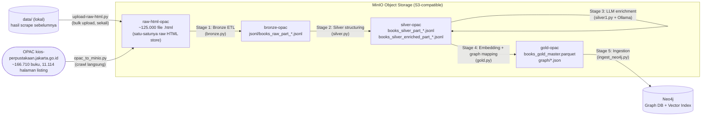
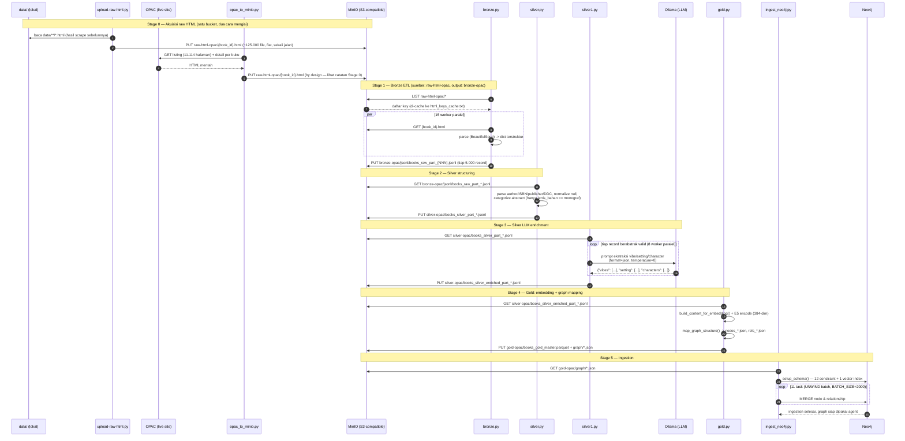
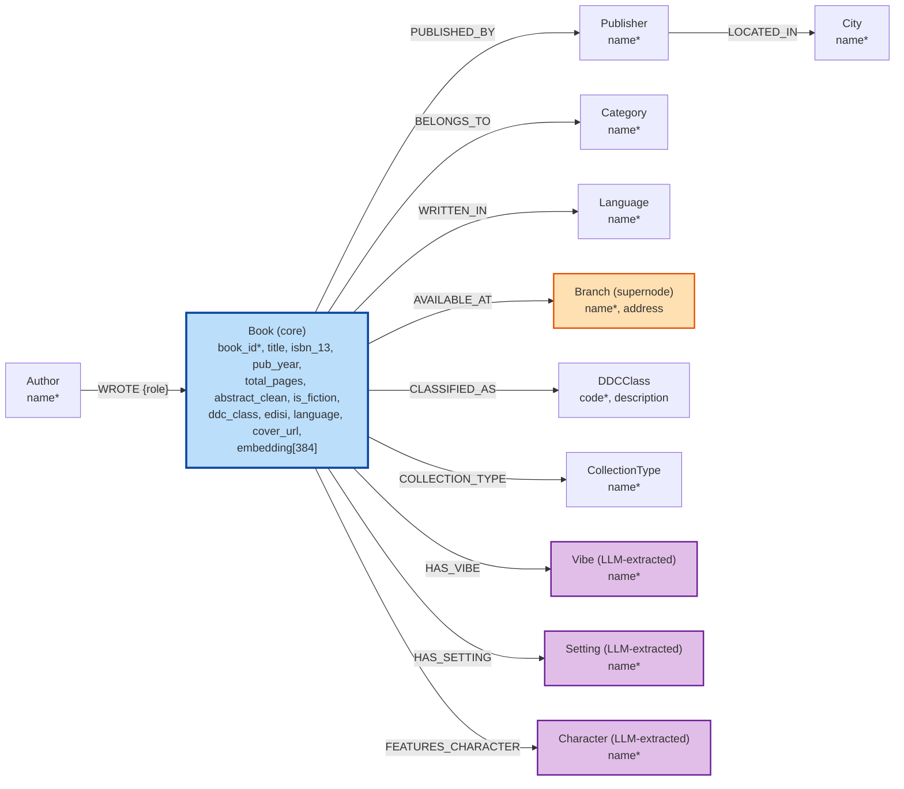

# Data Pipeline

## Gambaran Umum

Pipeline mengikuti arsitektur **Medallion** (Bronze → Silver → Silver
(LLM enrichment) → Gold) dengan **MinIO sebagai object storage di setiap
batas antar-stage** — diagram di bawah menggambarkan arsitektur target/
kanonis ini (bucket dideklarasikan di `.env`: `MINIO_BUCKET_RAW_HTML=raw-html-opac`,
`MINIO_BUCKET_BRONZE=bronze-opac`, `MINIO_BUCKET_SILVER=silver-opac`,
`MINIO_BUCKET_GOLD=gold-opac`).

> **Catatan implementasi saat ini**: Stage 2–4 (`silver.py`, `silver1.py`,
> `gold.py`) hari ini murni baca/tulis filesystem lokal — belum ada kode
> yang menghubungkan mereka ke `silver-opac`/`gold-opac` di MinIO. Diagram
> di bawah ini menampilkan alur **end-to-end via MinIO** sebagaimana
> seharusnya bekerja; detail teknis tiap stage (lokal vs MinIO, beserta
> jembatan manual yang masih dibutuhkan hari ini) didokumentasikan di
> bagian masing-masing stage di bawah.
>
> **Catatan korpus raw HTML — satu bucket, dua cara mengisinya**:
> `raw-html-opac` adalah **satu-satunya** raw-HTML store by design — baik
> upload bulk dari lokal (`upload-raw-html.py`) maupun crawl langsung
> (`opac_to_minio.py`) seharusnya menulis ke bucket ini. `bronze-opac`
> murni jadi **output** Stage 1 (`bronze.py`), bukan tempat singgah raw
> HTML — anggap `bronze-opac/html/` tidak pernah ada/dipakai. (Kode
> `opac_to_minio.py` saat ini masih menulis ke `MINIO_BUCKET_BRONZE`,
> bukan `MINIO_BUCKET_RAW_HTML` — inkonsistensi yang belum diperbaiki di
> script, lihat catatan di Stage 0.) `raw-html-opac` saat ini berisi
> ~125.000 file (hasil `upload-raw-html.py`, flat tanpa prefix). Lihat
> detail di Stage 0 & Stage 1 di bawah.

### Diagram Arsitektur (target)



---

## Sequence Diagram: Alur Data End-to-End

Asumsi: setiap stage baca input dari MinIO dan tulis output kembali ke
MinIO (arsitektur target, lihat catatan implementasi di atas untuk gap
Stage 2–4 saat ini).



---

## Skema Graf (Neo4j)

**File sumber kebenaran**: [shared/schema/neo4j_schema.py](../shared/schema/neo4j_schema.py).
Dokumentasi lengkap per-node (constraint, contoh nilai, catatan
implementasi) ada di [graph_ontology.md](graph_ontology.md) — diagram di
bawah ini adalah ringkasan visualnya. `*` menandai properti dengan
constraint `UNIQUE`.



12 node type, 11 relationship type. `Branch` ditandai sebagai supernode
(rata-rata relasi per node jauh di atas node lain — selalu difilter
terakhir di tool-calling agent, lihat
[agent_workflow.md](agent_workflow.md)). `Vibe`/`Setting`/`Character`
ditandai sebagai hasil ekstraksi LLM (open-vocabulary, bukan enum tetap)
— lihat Stage 3 di bawah.

---

## Stage 0: Akuisisi Raw HTML → MinIO

Dua cara mengisi raw HTML, **satu tujuan**: bucket `raw-html-opac`. Tidak
ada pipeline bercabang di sini — keduanya cuma jalur akuisisi yang
berbeda untuk korpus yang sama.

### Jalur A (aktif): `upload-raw-html.py` — bulk upload dari lokal

**File**: [data_pipeline/utils/upload-raw-html.py](../data_pipeline/utils/upload-raw-html.py)

Bulk-upload HTML yang **sudah ada secara lokal** (folder `data/`, hasil
scrape sebelumnya) ke bucket `raw-html-opac` — **flat, tanpa prefix**
(`object_name = nama_file`, bukan `html/{nama_file}`). 10 worker paralel
via `ThreadPoolExecutor`. Bucket name (`"raw-html-opac"`) **hardcoded**
di script, bukan dibaca dari env `MINIO_BUCKET_RAW_HTML` (env var itu ada
di `.env` tapi tidak direferensikan kode manapun — dead config, meskipun
bucket-nya sendiri sangat aktif dipakai).

```bash
python data_pipeline/utils/upload-raw-html.py
```

Ini yang mengisi korpus yang sebenarnya diproses pipeline saat ini —
`raw-html-opac` berisi ~125.000 file `.html`.

### Jalur B (by design, kode belum disesuaikan): `opac_to_minio.py` — crawl langsung

**File**: [data_pipeline/utils/opac_to_minio.py](../data_pipeline/utils/opac_to_minio.py)

Crawl langsung dari situs OPAC Perpustakaan DKI Jakarta ke MinIO — tidak ada
file lokal/ZIP/GDrive perantara (beda pendekatan dari Jalur A, yang justru
mengupload hasil scrape lokal). Target ~166.710 buku (11.114 halaman listing
× 15 buku/halaman). **By design, ini juga seharusnya menulis ke
`raw-html-opac`** — bucket yang sama dengan Jalur A, karena hasilnya
sama-sama raw HTML, bukan output Stage 1.

```bash
# 1. Kumpulkan link (sekali saja)
python data_pipeline/utils/opac_to_minio.py --collect --start 1 --end 11114

# 2. Download HTML & upload ke MinIO
python data_pipeline/utils/opac_to_minio.py --download --links collected_links.txt

# 3. Retry yang gagal
python data_pipeline/utils/opac_to_minio.py --download --links failed_links.txt
```

> ⚠️ **Inkonsistensi kode belum diperbaiki**: `opac_to_minio.py` saat ini
> menulis ke `MINIO_BUCKET = os.getenv("MINIO_BUCKET_BRONZE")` (`bronze-opac`,
> prefix `html/`), bukan ke `raw-html-opac` seperti Jalur A. Itu salah
> sasaran — `bronze-opac` seharusnya murni jadi **output** Stage 1
> (`bronze.py`), bukan tempat singgah raw HTML hasil crawl. Perbaikan yang
> benar: ubah env yang dibaca script ini dari `MINIO_BUCKET_BRONZE` ke
> `MINIO_BUCKET_RAW_HTML`, supaya Jalur A & B konsisten menulis ke bucket
> yang sama. Belum dilakukan — script masih dalam kondisi ini per
> commit terakhir.

Fitur: resume otomatis (aman jika proses berhenti di tengah), memory konstan
(HTML bytes dibuang setelah upload), progress di `crawler.log`.

---

## Stage 1: Bronze — HTML → JSONL

**File**: [data_pipeline/bronze/bronze.py](../data_pipeline/bronze/bronze.py)

### Tujuan
Parse HTML mentah dari bucket `raw-html-opac` (lihat Stage 0 — flat,
tanpa prefix, ~125.000 file) menjadi JSONL terstruktur, ditulis ke bucket
`bronze-opac` prefix `jsonl/`. `bronze-opac` murni jadi output Stage 1,
bukan tempat singgah raw HTML.

> **Catatan konfigurasi**: kode `bronze.py` membaca source bucket dari
> env `MINIO_BUCKET_BRONZE` (nama variabel ini sendiri agak menyesatkan —
> isinya seharusnya nama bucket *sumber* raw HTML, bukan bucket bronze).
> Sampai `opac_to_minio.py` diperbaiki untuk konsisten menulis ke
> `raw-html-opac` (lihat catatan Stage 0), `source_bucket`/listing prefix
> di `bronze.py` perlu dialihkan ke `raw-html-opac` (flat, tanpa prefix
> `"html/"`) secara manual saat dijalankan.

### Proses
1. List semua file `.html` (di-cache ke `html_keys_cache.txt` agar tidak
   perlu re-list MinIO setiap run).
2. `ThreadPoolExecutor` (15 workers) — tiap thread: download HTML →
   BeautifulSoup parse → dict.
3. Checkpoint upload setiap 5.000 record terkumpul:
   `jsonl/books_raw_part_{NNN}.jsonl` via `MinioClient.upload_jsonl()`
   (langsung `put_object`, **tidak ada salinan lokal**).

### Field yang Diekstrak (`_parse_metadata`)

Field diambil dari layout HTML `<p class="fw-bolder">` per label: `Jenis
Bahan`, `Judul Alternatif`, `Pengarang`, `Edisi`, `Pernyataan Seri`,
`Penerbitan`, `Bahasa`, `Deskripsi Fisik`, `ISBN`, `Abstrak` (selector
khusus). Holdings diparse dari `<table id="eksemplar">`.

### Schema Output Bronze

```json
{
  "source_id": "100091",
  "doc_id": "book_100091",
  "source_url": "https://kios-perpustakaan.jakarta.go.id/catalogue/detail/100091",
  "source": "minio_raw_html",
  "source_file": "100091.html",
  "ingested_at": "2026-04-21T04:14:16.609062",
  "title": "Simplify Your Complicated Life",
  "category_raw": "Kisah Inspirasi",
  "authors_raw": "Ronny F.Ronodirdjo ; Hieronymus Budi Santoso ; Purnomo",
  "publisher_raw": "Yogyakarta : Pohon Cahaya, 2017",
  "jenis_bahan": "Monograf",
  "judul_alternatif": "-",
  "edisi": "Cet. 1",
  "pernyataan_seri": "-",
  "language": "Indonesia",
  "deskripsi_fisik": "288 hlm ; 25 cm.",
  "isbn": "978-602-6336-90-3",
  "abstrak": "Tidak ada data.",
  "has_abstrak": false,
  "cover_url": "https://...",
  "has_cover": false,
  "num_holdings": 5,
  "holdings": [
    {"barcode": "00005271178", "call_number": "153.2 RON s",
     "branch_name": "Perpustakaan Jakarta - Cikini",
     "branch_address": "Jln. Cikini Raya No. 73, ...",
     "availability": "Tersedia"}
  ]
}
```

### ⚠️ Jembatan manual: MinIO Bronze → Lokal

`silver.py` (stage 2) membaca dari path lokal
`data_pipeline/bronze/books_raw_part_*.jsonl`. Belum ada script yang
otomatis mendownload hasil bronze dari MinIO ke folder ini — perlu
`mc cp` / `aws s3 cp` / boto3 ad-hoc sebelum lanjut ke Silver.

---

## Stage 2: Silver — Structuring (tanpa LLM)

**File**: [data_pipeline/silver/silver.py](../data_pipeline/silver/silver.py)

Beroperasi murni di filesystem lokal: baca
`data_pipeline/bronze/books_raw_part_*.jsonl`, tulis
`data_pipeline/silver/books_silver_part_*.jsonl`. Hanya record dengan
`jenis_bahan == "monograf"` yang diproses.

### Transformasi

| Fungsi | Tugas |
|---|---|
| `process_authors_modular` | `"Nama (role)"` / `"role: Nama"` / `"Belakang, Depan"` → `[{name, role}]`. Role dikenali dari daftar tetap (`penulis`, `penerjemah`, `ilustrator`, `editor`, dll.) |
| `process_isbn_modular` | Split ISBN-10 vs ISBN-13 (prefix `978`/`979`) |
| `process_publisher_modular` | `"Kota : Penerbit, Tahun"` → `{city, publisher, year}` |
| `process_physical_description` | `"288 hlm ; 25 cm"` → `{pages, dimension}` |
| `categorize_abstract` | Klasifikasi `Kosong/Null` \| `Teks Placeholder (Sampah)` \| `Terlalu Pendek (<50 char)` \| `Valid/Berkualitas` |
| `get_abstract_clean` | `abstract_clean` diisi **hanya** jika `abs_qual == "Valid/Berkualitas"` — abstrak mentah selalu dipreservasi di `abstract`, versi clean jadi `None` jika tidak valid (mencegah noise masuk embedding) |
| `check_fiksi` | DDC kelas 800 (`call_number` 3 digit awal `8`) ATAU penanda lokal (`f`/`fik`/`fiksi`/`fic`/`fiction` di call number) |
| `extract_ddc` | Regex `(\d{3})` pertama dari `call_number` → `(ddc_class, ddc_division)`, mis. `"813 SUY p"` → `("813", "8")` |
| `_normalize_null` | Normalisasi placeholder (`"-"`, `"."`, `"n/a"`, `"tidak ada data"`, dll.) → `None`, konsisten di semua field |

> Catatan desain: **tidak ada filter buang baris**. Buku fiksi tanpa abstrak
> valid tetap masuk silver dengan `abstract_clean=None` — datanya masih
> berguna untuk entity resolution (author/category/branch). Filtering
> agresif (jika diperlukan) terjadi di Gold, bukan di sini.

### Field yang Disalin Mentah dari Bronze

`language`, `edisi`, `jenis_bahan`, `pernyataan_seri`, `judul_alternatif`,
`source_url`, `has_cover` — dilewatkan langsung (lewat `_normalize_null`)
tanpa transformasi tambahan, supaya tersedia di Gold/graph tanpa perlu
join balik ke bronze.

### Schema Output Silver

```json
{
  "book_id": "100091",
  "title": "Simplify Your Complicated Life",
  "authors": ["Ronny F. Ronodirdjo"],
  "authors_metadata": [{"name": "Ronny F. Ronodirdjo", "role": "penulis"}],
  "categories": ["Kisah Inspirasi"],
  "isbn_10": null,
  "isbn_13": null,
  "pub_city": "Yogyakarta",
  "pub_name": "Pohon Cahaya",
  "pub_year": 2017,
  "total_pages": 288,
  "dimensions": null,
  "ddc_class": "153",
  "ddc_division": "1",
  "abstract": "Tidak ada data.",
  "abstract_clean": null,
  "abs_qual": "Teks Placeholder (Sampah)",
  "is_fiction": false,
  "available_branches": ["Perpustakaan Jakarta - Cikini"],
  "cover_url": "https://...",
  "language": "Indonesia",
  "edisi": "Cet. 1",
  "jenis_bahan": "Monograf",
  "pernyataan_seri": null,
  "judul_alternatif": null,
  "source_url": "https://...",
  "has_cover": false
}
```

> **Tidak ada lagi** `fiction_keywords` (regex vibe/setting/character) atau
> `content_for_embedding` di output Silver — keduanya dipindah/diganti
> (lihat Stage 3 & Stage 4).

---

## Stage 3: Silver — LLM Enrichment

**File**: [data_pipeline/silver/silver1.py](../data_pipeline/silver/silver1.py)

### Tujuan
Mengganti ekstraksi vibe/setting/character berbasis regex (pendekatan lama,
sudah dihapus dari `silver.py`) dengan ekstraksi LLM yang jauh lebih akurat
untuk teks bahasa Indonesia.

### Proses
1. Baca `data_pipeline/silver/books_silver_part_*.jsonl` (lokal).
2. Untuk setiap record dengan `abstract_clean` valid (**bukan hanya buku
   fiksi** — semua buku berabstrak), kirim ke Ollama via `ThreadPoolExecutor`
   (`MAX_WORKERS = 8` request paralel, bukan loop sekuensial).
3. LLM: `ChatOllama(temperature=0, format="json")` — grammar-constrained JSON,
   model dari env `OLLAMA_MODEL` (default `llama3.1:8b`).
4. Tulis `data_pipeline/silver/books_silver_enriched_part_*.jsonl` — record
   tanpa abstrak valid tetap ikut dengan `vibes/setting/characters = []`.

### Prompt

```
System: Kamu adalah sistem ekstraksi informasi. Balas HANYA dengan JSON
valid, tanpa penjelasan tambahan.
Format: {"vibes": [...], "setting": [...], "characters": [...]}
- vibes: nuansa/tema cerita — maks 5 item
- setting: latar tempat/dunia cerita — maks 3 item
- characters: nama tokoh utama yang disebut eksplisit — maks 5 item
Jika tidak ada, kembalikan list kosong [].

Human: Sinopsis:
<abstract_clean>
```

Output `vibes`/`setting`/`characters` adalah **open-vocabulary** (bukan
enum tetap) — LLM menentukan label sendiri dari konteks sinopsis, lalu
node `Vibe`/`Setting`/`Character` di Neo4j dibuat dari nilai-nilai unik ini
saat ingestion (lihat Stage 5).

### Menjalankan

```bash
python data_pipeline/silver/silver1.py
```

Script melakukan warm-up call ke Ollama dulu (`raise SystemExit(1)` jika
Ollama tidak bisa dihubungi) sebelum memproses ribuan record.

---

## Stage 4: Gold — Embedding + Graph Mapping

**File**: [data_pipeline/gold/gold.py](../data_pipeline/gold/gold.py)

Baca `data_pipeline/silver/books_silver_enriched_part_*.jsonl` (lokal),
tulis `data_pipeline/gold/books_gold_master.parquet` +
`data_pipeline/gold/graph/*.json` (lokal).

### `content_for_embedding` (dibangun di sini, bukan di Silver)

```python
def build_content_for_embedding(row) -> str:
    parts = [
        f"Judul: {row['title']}",
        f"Penulis: {', '.join(row['authors'])}" if row.get('authors') else None,
        f"Kategori: {', '.join(row['categories'])}" if row.get('categories') else None,
        f"DDC: {row['ddc_class']}" if row.get('ddc_class') else None,
        f"Sinopsis: {row['abstract_clean']}" if row.get('abstract_clean') else None,
    ]
    return ". ".join(p for p in parts if p)
```

Dipindah dari Silver ke Gold karena field ini murni untuk kebutuhan
embedding — menjaga Silver sebagai layer "data bersih" tanpa keputusan
representasi model.

### Embedding

- Model: `LazarusNLP/all-indo-e5-small-v4` (384 dimensi, multilingual Indo-optimized)
- Prefix E5: `"passage: "` (konvensi E5 untuk dokumen yang disimpan — berbeda dari `"query: "` yang dipakai saat pencarian runtime di `vector_tool.py`)
- Batch size 32, device CUDA jika tersedia else CPU

### DDC Label (division → kategori utama)

```python
_DDC_LABELS = {
    "0": "Ilmu Komputer & Umum", "1": "Filsafat & Psikologi", "2": "Agama",
    "3": "Ilmu Sosial", "4": "Bahasa", "5": "Sains & Matematika",
    "6": "Teknologi & Terapan", "7": "Seni & Rekreasi", "8": "Sastra",
    "9": "Sejarah & Geografi",
}
```

Digit pertama `ddc_class` (mis. `"813"` → `"8"`) dipetakan ke label ini saat
membangun node `DDCClass {code, description}`.

### Graph Mapping (`map_graph_structure`)

| Sumber kolom Silver | Node | Relasi |
|---|---|---|
| `authors_metadata` | `Author {name}` | `WROTE {role}` |
| `categories` | `Category {name}` | `BELONGS_TO` |
| `pub_name` + `pub_city` | `Publisher {name}`, `City {name}` | `PUBLISHED_BY`, `LOCATED_IN` |
| `available_branches` | `Branch {name}` | `AVAILABLE_AT` |
| `ddc_class` | `DDCClass {code, description}` | `CLASSIFIED_AS` |
| `language` | `Language {name}` | `WRITTEN_IN` |
| `jenis_bahan` | `CollectionType {name}` | `COLLECTION_TYPE` |
| `vibes` (dari silver1.py) | `Vibe {name}` | `HAS_VIBE` |
| `setting` (dari silver1.py) | `Setting {name}` | `HAS_SETTING` |
| `characters` (dari silver1.py) | `Character {name}` | `FEATURES_CHARACTER` |

### Output Files (lokal)

| File | Isi | Dibaca oleh Stage 5? |
|---|---|---|
| `graph/nodes_book.json` | Node Book: `book_id, title, isbn_13, pub_year, total_pages, cover_url, is_fiction, abstract_clean, ddc_class, edisi, language, embedding` | ✅ |
| `graph/rels_written.json`, `rels_category.json`, `rels_published.json`, `rels_available.json` | Relasi bibliografis | ✅ |
| `graph/nodes_ddc.json` | Node DDCClass lengkap (`code` + `description`) | ✅ (task backfill terpisah, lihat catatan di bawah) |
| `graph/rels_ddc.json`, `rels_language.json`, `rels_collection_type.json` | Relasi kepustakaan baru | ✅ |
| `graph/rels_vibe.json`, `rels_setting.json`, `rels_character.json` | Relasi hasil LLM enrichment | ✅ |
| `graph/nodes_author.json`, `nodes_category.json`, `nodes_publisher.json`, `nodes_branch.json`, `nodes_language.json`, `nodes_collection_type.json`, `nodes_vibe.json`, `nodes_setting.json`, `nodes_character.json` | Node non-Book lengkap dengan properti per entity-type | ❌ **tidak pernah dibaca** — lihat catatan di bawah |
| `books_gold_master.parquet` | Master DataFrame, dedup node via Python `set` lintas partisi | ❌ (hanya untuk debug/inspeksi lokal) |

`run_batch_gold()` memproses partisi satu per satu dan `gc.collect()` +
drop kolom besar (`content_for_embedding`, `abstract`) per partisi untuk
menjaga RAM stabil pada dataset besar.

### `nodes_*.json` non-Book — sebagian besar ditulis tapi tidak pernah dibaca

`ingest_neo4j.py` (Stage 5) membaca **langsung dari filesystem lokal**
`data_pipeline/gold/graph/` (`GRAPH_DIR`, bukan dari MinIO — tidak ada
jembatan upload manual yang diperlukan). `ingest_data_from_local()`
mendaftarkan task untuk `nodes_book.json`, **`nodes_ddc.json`**, dan 10
file `rels_*.json`. Node non-Book lainnya (`Author`, `Category`,
`Publisher`, `Branch`, `Language`, `CollectionType`, `Vibe`, `Setting`,
`Character`) masih selalu dibuat via `MERGE` di dalam query `rels_*.json`-nya
sendiri, hanya dengan properti yang ikut terbawa di situ (biasanya cuma
`name`) — file `nodes_*.json` non-Book untuk entitas-entitas ini tidak
pernah dimuat oleh task manapun.

> ✅ **`DDCClass.description` — sudah diperbaiki.** Sebelumnya
> `rels_ddc.json` cuma membawa `book_id` + `ddc_code`, jadi node `DDCClass`
> yang ter-ingest tidak pernah punya `description` meski field-nya
> dideklarasikan di [shared/schema/neo4j_schema.py](../shared/schema/neo4j_schema.py)
> dan ditulis dengan benar ke `nodes_ddc.json` oleh `gold.py`. Task
> `"DDCClass.description backfill"` (baca `nodes_ddc.json`, `MERGE` +
> `SET ddc.description`) sudah ditambahkan ke `ingest_data_from_local()` —
> setiap full reingest sekarang otomatis mengisi properti ini. Database
> yang sudah ter-ingest sebelum task ini ditambahkan juga sudah dibackfill
> manual (one-off Cypher `MERGE`+`SET` langsung ke live graph, tanpa drop)
> sehingga konsisten dengan kode saat ini.
>
> `Branch.address` punya nasib lebih baik sejak awal: aman dari masalah ini
> karena kebetulan dibawa langsung di `rels_available.json` (`value.address`),
> bukan lewat `nodes_branch.json` yang terpisah. Node non-Book lain
> (`Author`, `Category`, dll.) tidak punya properti tambahan selain `name`
> di skema saat ini, jadi pola yang sama belum jadi masalah nyata untuk
> mereka — tapi kalau nanti ada properti baru ditambahkan ke salah satu
> node itu, pola perbaikannya sama seperti `DDCClass`: tambahkan task baru
> di `ingest_data_from_local()` yang membaca `nodes_*.json` terkait.

---

## Stage 5: Ingestion ke Neo4j

**File**: [data_pipeline/utils/ingest_neo4j.py](../data_pipeline/utils/ingest_neo4j.py)

### Setup Schema

```cypher
CREATE CONSTRAINT IF NOT EXISTS FOR (b:Book) REQUIRE b.book_id IS UNIQUE
CREATE CONSTRAINT IF NOT EXISTS FOR (a:Author) REQUIRE a.name IS UNIQUE
CREATE CONSTRAINT IF NOT EXISTS FOR (c:Category) REQUIRE c.name IS UNIQUE
CREATE CONSTRAINT IF NOT EXISTS FOR (br:Branch) REQUIRE br.name IS UNIQUE
CREATE CONSTRAINT IF NOT EXISTS FOR (p:Publisher) REQUIRE p.name IS UNIQUE
CREATE CONSTRAINT IF NOT EXISTS FOR (ddc:DDCClass) REQUIRE ddc.code IS UNIQUE
CREATE CONSTRAINT IF NOT EXISTS FOR (l:Language) REQUIRE l.name IS UNIQUE
CREATE CONSTRAINT IF NOT EXISTS FOR (city:City) REQUIRE city.name IS UNIQUE
CREATE CONSTRAINT IF NOT EXISTS FOR (ct:CollectionType) REQUIRE ct.name IS UNIQUE
CREATE CONSTRAINT IF NOT EXISTS FOR (v:Vibe) REQUIRE v.name IS UNIQUE
CREATE CONSTRAINT IF NOT EXISTS FOR (s:Setting) REQUIRE s.name IS UNIQUE
CREATE CONSTRAINT IF NOT EXISTS FOR (ch:Character) REQUIRE ch.name IS UNIQUE

CREATE VECTOR INDEX book_vector_index IF NOT EXISTS
FOR (m:Book) ON (m.embedding)
OPTIONS {indexConfig: {
  `vector.dimensions`: 384,
  `vector.similarity_function`: 'cosine'
}}
```

### Batch Ingestion

12 task berurutan, masing-masing `UNWIND $batch` dengan `BATCH_SIZE = 2000`
per transaksi (menjaga heap Neo4j stabil untuk dataset besar):

`nodes_book` → `rels_written` → `rels_category` → `rels_published`
(termasuk `FOREACH` membuat `City` + `LOCATED_IN` jika `value.city` ada) →
`rels_available` → `nodes_ddc` (backfill `description`) → `rels_ddc` →
`rels_language` → `rels_collection_type` → `rels_vibe` → `rels_setting` →
`rels_character`.

> **Tidak ada lagi** langkah "Build SIMILAR_TO" (dulu: KNN top-5 neighbor,
> threshold ≥0.85). Relasi itu sudah dihapus total dari skema — kemiripan
> antar buku sekarang dihitung **runtime** lewat `book_vector_index`, baik
> oleh `VectorSearchTool` (front-door, dipakai untuk query "buku mirip X")
> maupun lewat template `search_similar_runtime` di
> [agent/tools/tools_catalog.py](../agent/tools/tools_catalog.py) (lihat
> [agent_workflow.md → Tool Registry](agent_workflow.md#tool-registry)),
> bukan pre-computed saat ingestion.

> **⚠️ `ingestor.drop_all()` dipanggil unconditional di `__main__`.**
> Menjalankan `python data_pipeline/utils/ingest_neo4j.py` langsung
> **menghapus seluruh graph** (`MATCH (n) DETACH DELETE n`) sebelum
> reingest dari `GRAPH_DIR` lokal. Untuk perbaikan kecil yang aman (mis.
> backfill satu properti pada node yang sudah ada), lebih murah dan lebih
> aman menjalankan query `MERGE`/`SET` yang ditargetkan langsung lewat
> driver `neo4j`, bukan re-run script penuh ini.

---

## Menjalankan Pipeline End-to-End

### Prerequisite
- MinIO reachable (`.env`: `MINIO_ENDPOINT`, `MINIO_ACCESS_KEY`, `MINIO_SECRET_KEY`, bucket env vars)
- Ollama jalan dan reachable di `OLLAMA_BASE_URL` dengan model yang diset di `OLLAMA_MODEL` (untuk Stage 3) — lokal atau remote (mis. di-tunnel via SSH ke GPU server)
- Neo4j jalan (`.env`: `NEO4J_URI`, `NEO4J_AUTH`)
- `HF_TOKEN` jika model embedding butuh auth Hugging Face

### Urutan Eksekusi

```bash
# Stage 0 — crawl OPAC → MinIO bronze-opac/html/ (sekali, butuh berjam-jam untuk full dataset)
python data_pipeline/utils/opac_to_minio.py --collect --start 1 --end 11114
python data_pipeline/utils/opac_to_minio.py --download --links collected_links.txt

# Stage 1 — Bronze: HTML (MinIO) → JSONL (MinIO)
python data_pipeline/bronze/bronze.py

# ⚠️ manual: download bronze JSONL dari MinIO ke data_pipeline/bronze/ lokal

# Stage 2 — Silver: structuring (lokal → lokal)
python data_pipeline/silver/silver.py

# Stage 3 — Silver: LLM enrichment, butuh Ollama jalan (lokal → lokal)
python data_pipeline/silver/silver1.py

# Stage 4 — Gold: embedding + graph mapping (lokal → lokal)
python data_pipeline/gold/gold.py

# ⚠️ manual: upload data_pipeline/gold/graph/*.json ke MinIO bucket gold-opac

# Stage 5 — Ingest ke Neo4j (lokal → Neo4j; lihat catatan drop_all() di atas)
python data_pipeline/utils/ingest_neo4j.py
```
